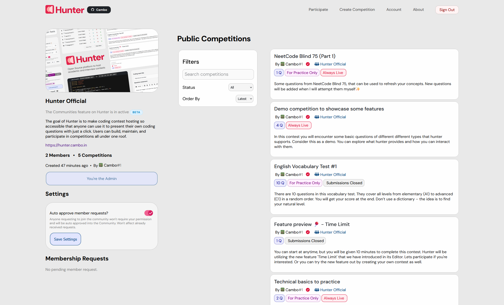

# Communities on Hunter

## What are Communities on Hunter?

Communities are spaces where people from the same college, school, or group come together to learn, share, and grow. They’re built around common goals like coding, creativity, or collaboration.

## Why Create a Community?

-   Bring together students, teachers, or members who share the same passion Learn and grow together.
-   Members get notified whenever you host a contest in the community.
-   Show your identity, represent your institution or group on the platform Build engagement
-   Stay active to make your presence lively, and let your members participate in your fun contests

## What Does It Look Like?

To get a better idea of how a community appears, visit the official Hunter community:  
https://hunter.cambo.in/communities/browse/1

 

# How to Create One?

1. Log in to the site.
2. Go to the community creation form: https://hunter.cambo.in/communities/create
3. Fill out all required fields in the form and submit your request.
4. Our team will review your submission and notify you by email once it has been approved.

## How to link contests with the Community?
- Open the editor of the competition that you want to link with your Community.
- You should see a new panel in the side bar that allows you to do the same. 
- Just select the community, and save changes.
